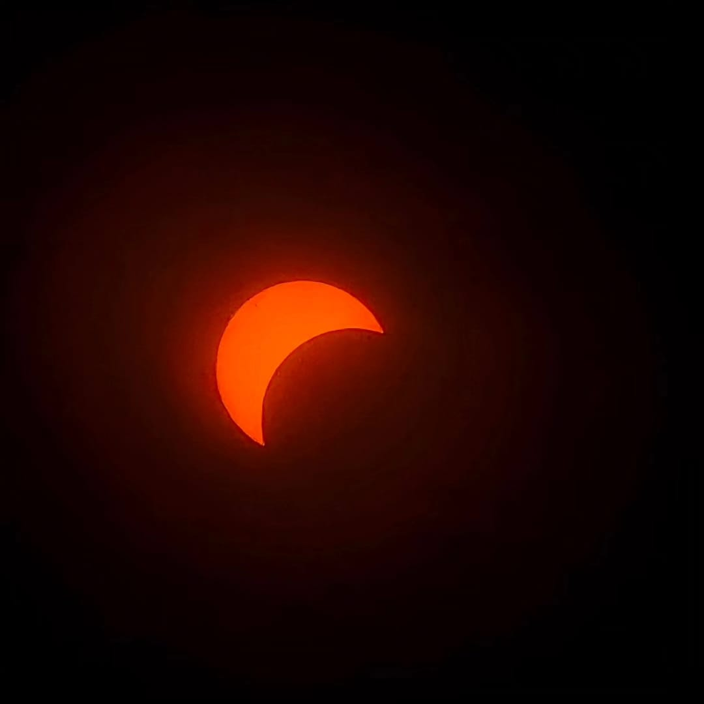
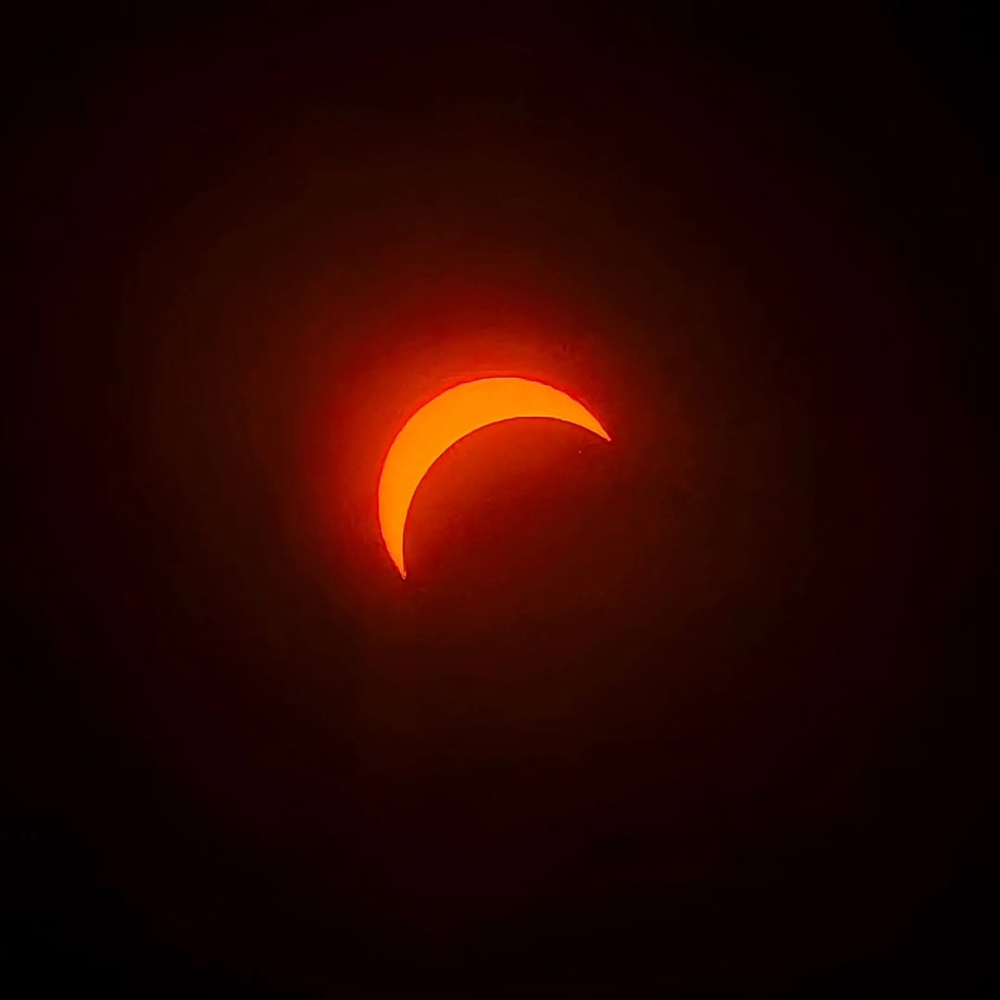

## Awesome has a new definition

Witnessing the total solar eclipse at the Indianapolis Motor Speedway on April 8, 2024, was an experience beyond words. As an avid Formula One fan, the anticipation was palpable as we arrived at the circuit around noon, eagerly awaiting the moment of totality at 3:07 PM.

The gradual progression of the moon taking a bite out of the sun was mesmerizing and even at around 90% of the eclipse it remained impossible to look up without the protective glasses.

Stepping onto the track just minutes before totality provided an extraordinary experience, with the iconic start/finish line as the backdrop for unforgettable photographs.

But it was during the fleeting moments of totality that everything changed. Transported to a different dimension, the world seemed to shift around me, and an indescribable sense of awe enveloped me. The bright ring of the sun, entirely obscured by the moon, cast a supernatural glow upon the landscape.

This moment, etched into my memory forever, served as a profound reminder of the beauty and wonder of the universe. Here's to hoping for the opportunity to witness such a spectacle again.
