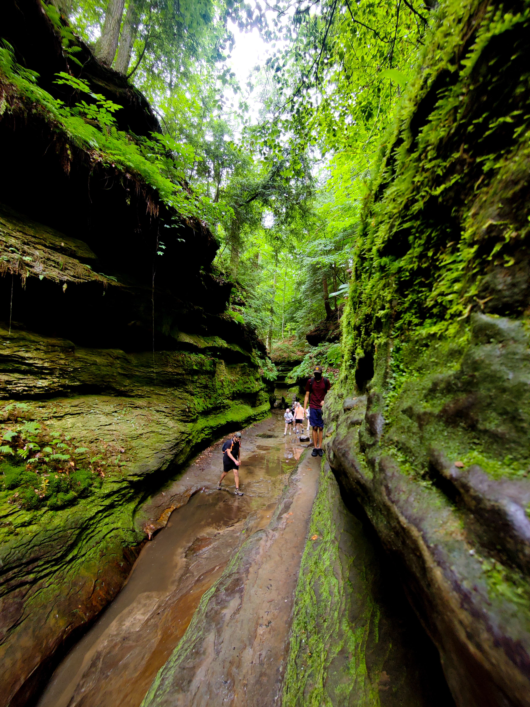
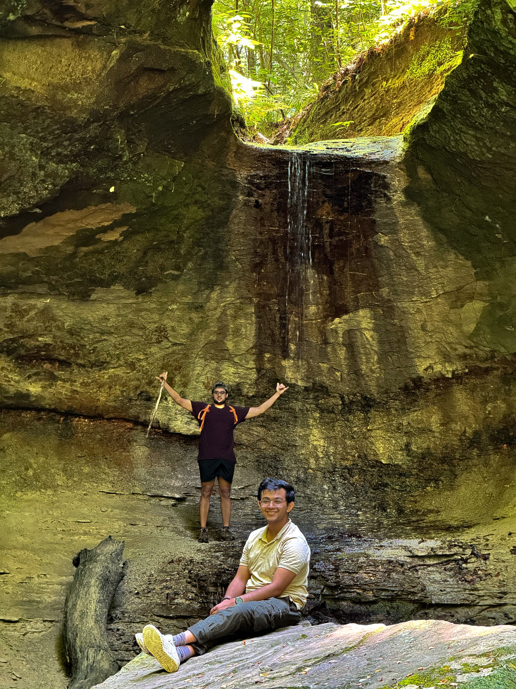
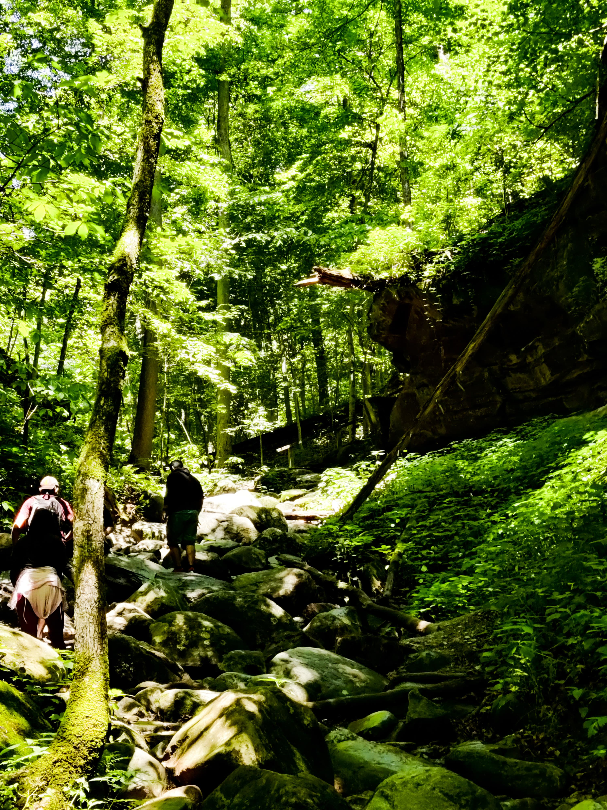
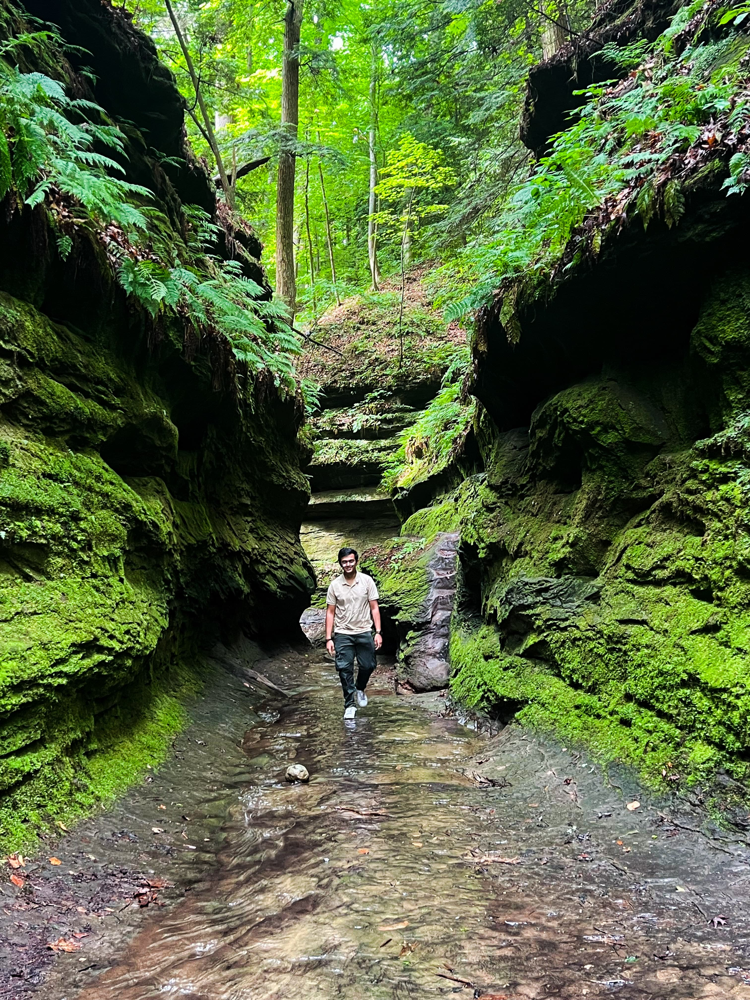
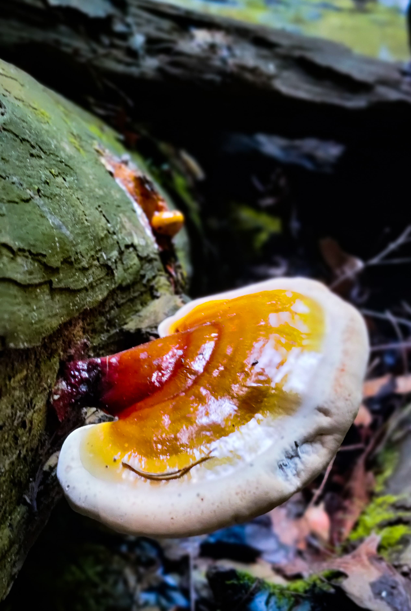
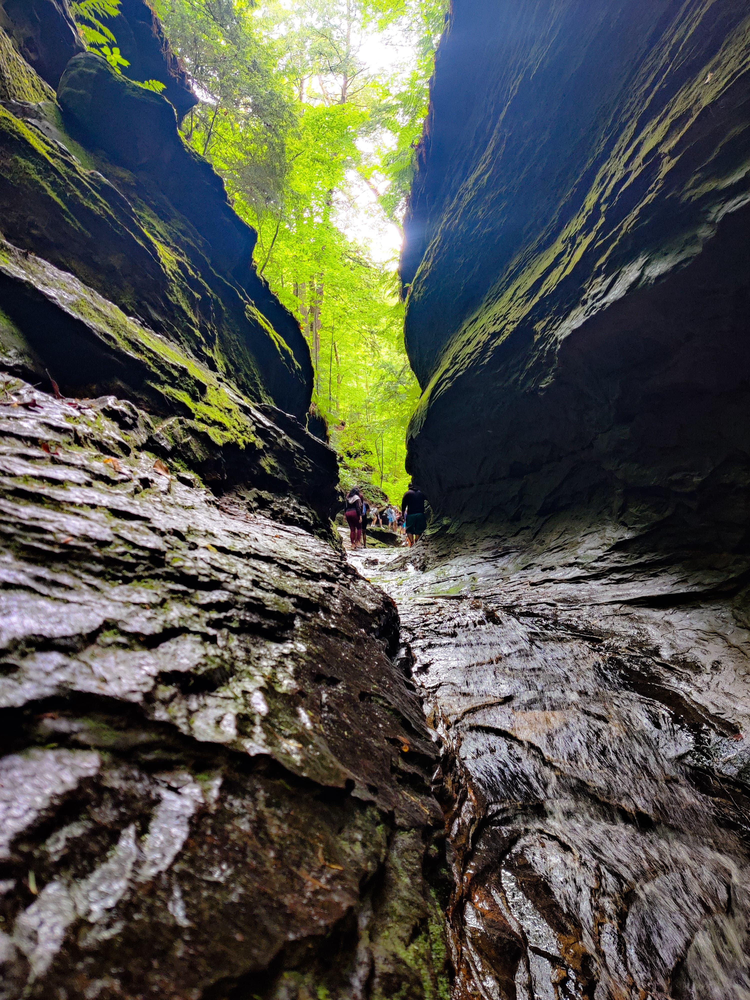

### A perfect day trip

Turkey Run State Park in Indiana offers a stunning escape into nature. Our hike took us through lush forests, striking rock formations, and serene waterways. To my dismay, there were no turkeys, let alone running turkeys (Sorry for the bad Joke); however, Turkey Run offered an unforgettable adventure.

Check out the images below from our hike!

