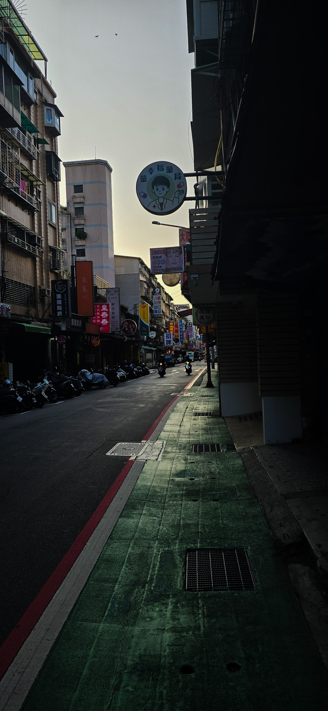
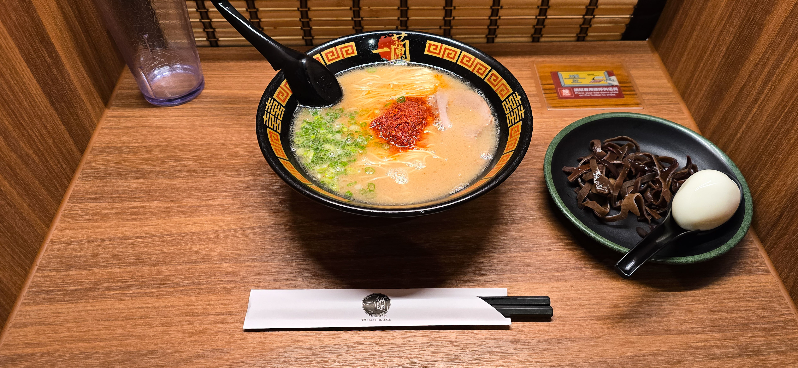

## Food, Embedded Systems & the City of Taipei

There’s a very high probability that the device you’re reading this on has parts from the tiny island of Taiwan. Having gained fresh attention thanks to TSMC, Taipei may not be as globally famous for rich culture and anime as Japan, or for food, beauty, and K-pop like Korea. Still, this island is packed with the technological marvels I geek out about, semiconductors and electronics, and it’s home to my favorite laptop brand, ASUS. Here to present my work, SecuPilot, at ESWEEK. During my six days exploring the streets of Taipei, I came to appreciate this friendly, calm, and beautiful city.

## Taipei 101: Bamboo Giant, Gentle Soul

Before I write anything else, I have to appreciate Taipei 101. Of all the skyscrapers here, this building has the most character and is now my favorite tall building. The bamboo-inspired, elegant tower is the highlight of the skyline. It doesn’t scream “I’m tall,” but stands peacefully, drawing my attention at any time of day. Another fascinating aspect is the chance to see the tuned mass damper above, designed to reduce swaying during the earthquakes common in Taipei, a vivid reminder of the engineering marvel it is. And adding even more character to 101 is the RGB lighting on the exterior (everything RGB!) that cycles through the rainbow each night.
ESWEEK 2025: Big Ideas, Mixed Signals
First, I’m grateful to my professor for letting me attend and present my work. ESWEEK spans a broad spectrum of topics, and the keynotes were the highlights for me. The first, by Prof. David Atienza Alonso, offered insight into how wearables can impact health and the key enablers behind them. Next, Prof. Nikhil Dutt spoke on what he calls “mindful AI,” an intriguing approach to designing AI systems for the edge. While a matter of personal taste, I struggle to sit through long sequences of short talks. The technical track at ESWEEK felt rather lackluster, with much of the work seeming repetitive and not especially thought-provoking. Finally, the organizers somehow managed to do an injustice to Taipei’s culinary delights.

## Pearls, Broth, and Perfect Noodles

My favorite thing about traveling to any new place is trying the food, and Taipei did not disappoint. With a huge variety and cheap eats everywhere, I might not cover everything here, but the highlights were the soup‑filled dumplings and chili‑oil wontons at Din Tai Fung, which finally dethroned Indian street momos. The ramen at Ichiran, after seeing it in countless food blogs, finally made sense once I tried it; the solo‑booth experience redefined ramen for me. The broth was so rich, the noodles perfectly thin and firm, and the extra kick from eggs, mushrooms, and garlic tied it all together. Just the perfect bowl of noodles, made with care and precision. And lastly, the boba tea. I never knew tapioca pearls could be chewy and melt in your mouth at the same time. The tea was perfectly flavored and sweet, and the milk foam didn’t wreck the texture. Xing Fu Tang even had me traveling across town twice.

## Lanterns, Waterfalls, and a Dash of Ghibli

When I read that there’s a town said to have inspired Spirited Away, I knew I had to visit. The first stop on this day trip was Shifen, a tiny town straddling the railway tracks and clearly a tourist trap. Everything about it screamed tourism. It’s famous for its waterfall, which, honestly, was quite average, and for releasing sky lanterns. Every five feet, I was asked if I wanted to launch one, and the shops just had mass-produced souvenirs. However, the little trains rumbling through every thirty minutes made for beautiful shots. I took an early‑afternoon train to Jiufen and arrived at a lovely hill station draped in lanterns. I spent the hot afternoon in a teahouse with a gorgeous view of the ocean and mountains, then visited a workshop where artisans were hand‑crafting tea sets. I even picked up a beautiful cup for my espresso shots (coffee >>> tea). As the sun set, the town came alive under the lantern glow, truly feeling like a journey into the world of Spirited Away; A‑Mei Teahouse definitely has its charm. I nearly visited every shop trying to find a small lantern to take home, but they were either too big or overly ornate; none had the simple charm of the street lanterns or were small enough to carry back.

## Steps, Statues, and Sunset Blues

The city’s landmarks did not disappoint. The Chiang Kai‑shek Memorial Hall is truly grand and an impressive tribute to a defining figure in Taiwan’s modern history. Next came the hike up Elephant Mountain: a steep climb on the city’s edge, with a seemingly endless spiral of steps enough to make your calves shiver. The summit rewards you with a beautiful view of 101; I reached just in time for sunset on a slightly cloudy day, watching the sky burn vermilion while 101’s polished façade gleamed in shades of blue, until the blinking city lights took over. The descent ended at a nearby Buddhist temple, where a kind older lady asked me to light incense sticks. That moment felt special. Across the many Buddhist temples I visited in the city, each had unique wall art, bright red pillars, and gilded carvings. One of the finest was Longshan Temple, with intricate detailing and a broad courtyard; monks were giving a sermon when I visited, a vibrant, textured experience.

## A City That Trusts You Back

What a wonderful city. It’s clearly designed with pedestrians in mind, making commuting easy and blending the rush of a modern metropolis into a calm atmosphere. Studded with 7‑Elevens and dragon‑laden temples in every nook and corner, Taipei is endlessly fun and easy to explore. I picked up a city travel card that worked on the neon-lit buses and the frequent, expansive, and dirt-cheap MRT. One theme echoed across the city: cleanliness and patience. People wait for pedestrians, and they let riders disembark before boarding the metro. It’s not just advanced; it’s people‑friendly. Free umbrellas on rainy days, water‑refilling stations everywhere, and warning sirens outside underground parking lots to alert pedestrians as cars exit, I could go on. The city made me feel safe and respected, whether on a tiny side street or in a bustling market. I haven’t experienced this combination anywhere else, and I hope more cities move in this direction.

