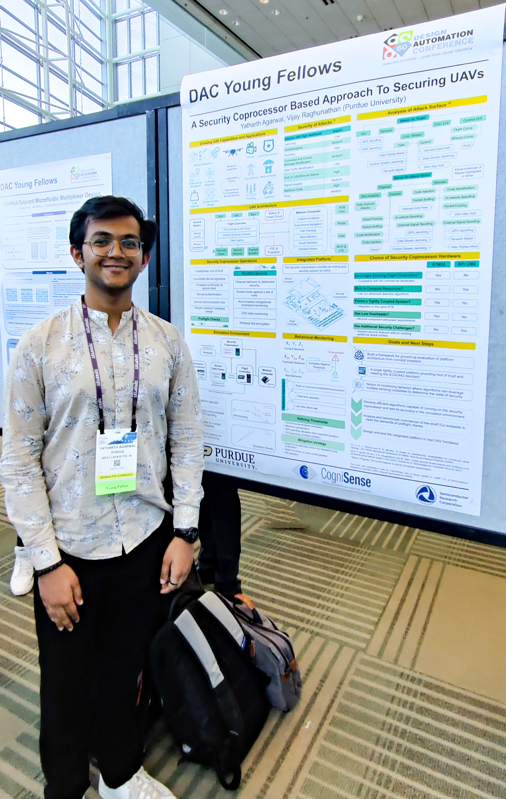

## 61st Design Automation Conference

Attending a conference in the United States for the first time was an exciting experience, and I wasn't quite sure what to expect. The week leading up to the event was spent preparing a poster to showcase my work as part of the DAC Young Scholars Program. Being selected for this program was my gateway to participating in this global conference that brought together industry and academia. Over the span of five days, I attended numerous talks, which provided a multidimensional insight into the EDA industry. I connected with people from around the world and, to top it off explored the city of San Francisco. Although it’s challenging to summarize everything I learned or remember every session I attended, as I constantly hopped between the countless parallel sessions, I’ve done my best to capture my key takeaways and the sessions that gave me much food for thought.

---

### Key Industry Trends

**Hardware and Software Interaction:** Understanding the interaction between hardware and software is crucial, and it’s important to delve deeply into each layer. When building new hardware architectures, analyzing the different levels of abstraction in software has a profound impact. Similarly, leveraging hardware requires designing software accordingly. Jim Keller emphasized this in his keynote, showcasing how Tensorrent leverages multiple local compute units that excel in long-distance data communication.

**Chiplets:** Almost every major company and talk mentioned chiplets, supported by strong evidence. Unlike AI, which is often used as a buzzword, chiplets are a significant trend due to the challenges of developing technologies beyond the 5nm and 3nm technodes without sacrificing yield and manufacturing costs. As designs evolved to have entire systems on chips, die sizes expanded to their limits. This raises the question: Is Moore's Law dying? The industry has shifted towards using chiplets or multiple dies on the same PCB. This approach uses smaller dies with higher yields, allowing for dies with different technodes in one package. However, it also presents challenges related to mechanical and thermal stresses and the need for appropriate communication protocols between chips to keep Moore's Law alive.

**Digital Twins:** This term is beloved by marketing teams and leadership roles, even though it's essentially a fancy term for simulations—the foundation of silicon EDA since its inception. The cost of failure is increasing, and time to market is becoming more crucial. Creating a digital twin of a system can predict functionality and make the development cycle parallel. While the advantages of digital twins are notable, it doesn’t justify creating a digital twin for everything in existence.

---

## Technical talks

### How AI Will Drive EDA and IP Growth: Insights from Charles Shi

Charles Shi delivered an outstanding and well-structured talk, providing a comprehensive view of the EDA industry from a Wall Street perspective. It was truly mind-blowing to see how historical facts and trends can be pieced together to predict future developments.

In the era of personal computing, Intel reigned supreme in the semiconductor industry, controlling both the hardware and foundry aspects. The next phase, the mobile computing era, saw a shift to fabless manufacturers, though software and hardware were still produced by different companies. As we transition into the age of AI computing, Nvidia has emerged as the leader, controlling the entire software and hardware stacks while relying solely on TSMC for manufacturing. This trend is being followed by more and more companies, with Apple leading in the personal computing space and Meta, Microsoft, and Google developing their own chips.

Given these observations, the prediction is that Nvidia will continue to dominate the field. As computing demands grow, designs will increasingly rely on chiplets. Therefore, EDA companies must focus on investing in tools for chiplet-based designs to stay ahead in this evolving landscape.

### Cooleys troublemakers

I am officially a fan of John Cooley from Deepchip. 

### Perspective on security

### Scaling beyond 5nm and analysis by the Yole Group

### Immersive computing

---

## Birds-of-a-Feather: Open-Source EDA, Data and Benchmarking Summit

I am a strong supporter of open-source EDA tools and have learned the most about VLSI through them. Meeting and attending talks by pioneers in the community and participating in the session was truly special. Here is the link to all the slides and talks.
[https://open-source-eda-birds-of-a-feather.github.io/](https://open-source-eda-birds-of-a-feather.github.io/)

### GDS factory

Python library aimed towards design analog and photonic ICs [https://github.com/gdsfactory/gdsfactory](https://github.com/gdsfactory/gdsfactory)

### PACT

Spice based thermal simulator [https://github.com/peaclab/PACT](https://github.com/peaclab/PACT)

### tclint

Linting tool for tcl [https://github.com/nmoroze/tclint](https://github.com/nmoroze/tclint)

---

## SSH-SoC: Safety and Security in Heterogeneous Open System-on-Chip Platforms

### Jon opentitan

### Ryan Kastner

### Basilisk 

### John east: How we got here

---

## Interesting Research projects

### [https://zardini.mit.edu/](https://zardini.mit.edu/)

### CEDAR

### Robotics talks

---

## Young Fellows Poster session

Since the start of my master's program, I have seen numerous posters, and it was finally my turn to design and present one. I compiled all my progress and printed it on a massive A0 paper. The poster session of the Young Fellows Program attracted quite a crowd. Presenting my work helped me better articulate my path forward and receive valuable feedback from many people.

---

## Exploring San Fransisco

San Francisco is known for its chilly climate, with brisk winds blowing in from the Pacific, but it still has really pleasant weather with a warm sun. The Golden Gate Bridge provides a magnificent backdrop, while the bustling areas of Pier 39 and Fisherman’s Wharf add to the city's charm.

On the last day of the conference, we took a ride on the historic cable car and visited the lively Pier 39, where we watched the playful sea lions. We then indulged in some local cuisine, savoring the famous sourdough bread with chowder. Our culinary journey continued with a visit to the Ghirardelli Chocolate Factory, where I tasted the best fudge I've ever had. Unfortunately, we missed a tour of the Alcatraz Islands due to a shortage of time.

San Francisco is renowned for its exceptional food scene, but it often comes with a hefty price tag. Despite this, I enjoyed some incredible dishes, including delectable hummus and the legendary overloaded Mission burrito.
