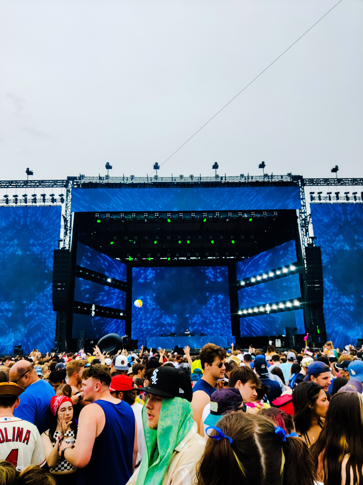

## My First Indy 500 Experience

I remember searching F1 tracks while choosing which colleges to apply to. The Austin GP was appealing, but the Indy 500 comes close, especially since it's regarded as among the triple crowns of motorsports.

The day finally came—it was race day. We left home at 6 am, exhausted from yesterday's trip to Turkey Run. We set off with snacks and drinks packed and prepared for the forecasted storm.

### Parking Woes

All of us were newbies when it came to the greatest spectacle in motor racing. We didn't have any tickets to the official parking lot, but resellers offered them for a crazy price of $270, so we decided to figure it out on race day.

Our solution was to park a few miles from the circuit and take an Uber to the circuit. While going, it worked out perfectly. But as we got closer to the Indianapolis Motor Speedway, we saw locals offering parking in their yards for $20. We thought, "Ah, damnit," but it was too late to change our plan.

### Snake Pit

I was definitely an EDM fan in high school, with favorites like Martin Garrix, Calvin Harris, Avicii, and Kygo. Those concerts are still on my bucket list. Gryffin was one of the artists I recognized on the lineup. The Snake Pit gave me a taste of why American EDM concerts are famous. After vibing for a couple of hours and reminiscing over all the tracks by Gryffin, the set concluded with an announcement: "Please exit the Snake Pit and seek shelter. Severe weather expected..."

### The Long Wait

While motor racing can take place in damp conditions with special tires, there's a limit to safety concerns. The coming storm was nowhere near safe for racing. We were practically stranded and took shelter under the grandstands with no car nearby. I eventually fell asleep, feeling like I was reliving Spa 2021, just praying we'd get a few laps of track action.

### Clouds Clear

Finally, after a four-hour delay, we were allowed to return to the grandstands. To my surprise, even after the wait and the weather, all the stands were packed to their massive capacity of 350,000 people. That's when it slowly hit me that the Indy 500 attracts a fair chunk of motorsport enthusiasts and is mainly attended by locals who see this as an annual event of partying and soaking in the atmosphere. That makes the Indy 500 special: you don't have to follow a single race or know anything about racing. The food, the crowd, its rich history, and its falling on Memorial Day weekend make it a unique American tradition. With the race start procedures underway and massive soakers drying the track, we had the Thunderbirds fly past and the 11 rows of 3 cars completing the formation laps.

### Inner Fanboy Goes Crazy

People might say it's just cars going in circles, but remember, that's 500 miles at 250 miles per hour! The skill required to complete that feat and, more importantly, the engineering behind making such a machine makes me love this sport. Watching them on screen has always been exhilarating, but standing 30 feet from the track is a different experience altogether. The sound of the engines roaring in perfect harmony with occasional backfires is absolute music to the ears. The smell of burning rubber during lockups and the gust of wind as these aerodynamic works of art pierce through the surroundings complete the sensory overload one experiences. Only racing fans appreciate the yellow flags and pit stops in a race. This particular running had seven yellow flags, and the five mandatory pit stops in the Indy 500 make the order completely shuffle with every passing moment, unlike the Monaco GP a few hours prior.

Being the only team with cars in F1 and IndyCar, McLaren had me rooting for Pato O'Ward. He drove incredibly well in the 107th Indy 500, having led 39 laps, only to crash out with seven laps to go. The last ten laps of this year's race had everyone on the edge of their seats, with a four-way fight and the leader changing every lap. I cheered as O'Ward passed Newgarden for the lead on the front stretch on lap 199. However, Newgarden got a run on O’Ward at Turn 3, right in front of where I was standing, to win the Indy 500 for the second time in a row.

<video controls src="indy5.mp4" title="Title"></video>

### The Nightmare Begins

Having left as satisfied fans but exhausted from the day's events, it took us an hour to walk out to a point where we hoped to get an Uber. Four canceled cabs later, we realized that where we stood was entirely blocked by traffic. So we walked down another mile, where a couple of people waited for Ubers. However, most routes were blocked to keep the traffic flowing, which left Uber drivers confused about how to reach our location. Having waited two hours, it turned into a game of whether the driver would take one specific left that would lead them to us. As the night grew darker and it started to pour again, the five of us, hungry and tired, finally managed to get a cab, resulting in a two-hour drive back home.
