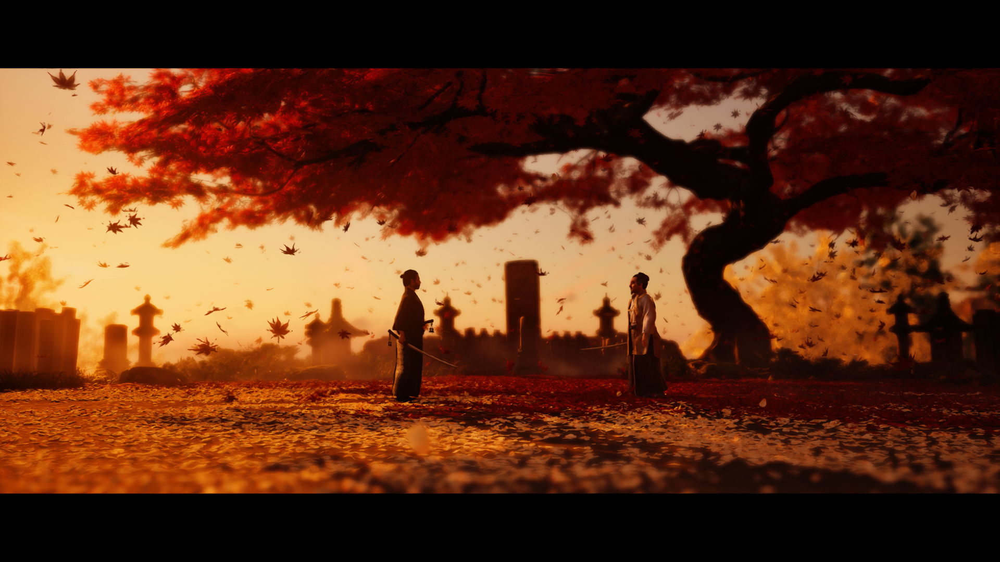

### The Ghost of Tsushima: A Samurai's Tale

While *The Witcher 3* will always be my gold standard for RPGs, *Ghost of Tsushima* comes remarkably close with its enthralling samurai lore.

From the outset, the graphics and landscapes are incredibly immersive. There are moments when you just want to pause and soak in the beauty of Tsushima. Sucker Punch Studios expertly crafted the camera angles and aspect ratios of the surrounding forestry, truly transporting you into the game. Every landscape is intricately tied to the story, compelling you to explore the map, whether it’s the chrysanthemum flower fields or the pampas grasslands.

Running the game on high graphics settings, my RTX 2060 was pushed to its limits. I experienced significant frame drops in dense forestry or during harsh weather conditions, and the game struggled with rendering water bodies accurately, making waterfalls and rivers look unnatural.

Graphics aside, the main story meticulously develops Jin Sakai's character, torn between his honor as a Samurai and his transformation into the Ghost, adopting unorthodox methods to fight the Mongol invasion. As Jin evolves, his companions offer engaging side quests and delightful moments. The missions with Yuriko were some of my favorites, while those with Kenji added a humorous touch.

The legendary tales add another layer to Jin's combat abilities. Collecting Gosaku's armor was a demanding task but worth every minute. Once fully upgraded and dyed black, the fine details showcase the samurai's glory.

The game mechanics, including the various stances that influence combat, are well-designed. As someone who values storytelling, I appreciate that cut scenes are unskippable, though I understand that some players might find this frustrating. However, despite the engaging narrative, the combat can become repetitive and tedious toward the end. With enemies remaining essentially the same and combat strategies becoming predictable, even boss fights lose their edge.

Overall, *Ghost of Tsushima* offers a fantastic experience with stunning graphics and a compelling story. Jin has become one of my favorite characters, and perhaps, as the Ghost, I will eventually drive out all the Mongols.
